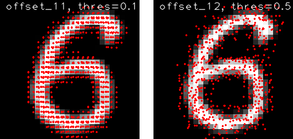

## Introduction
This repo is a tensorflow implementation of [deformable convolution]("https://arxiv.org/abs/1703.06211") with C++/CUDA. 
The core CUDA implementation logic is borrowed from the original [MXNet implementation]("https://github.com/msracver/Deformable-ConvNets")
and I rewrote the code to increase the readability.

The repo also contains a simple trial test and visualization of the offsets, which lies at the core concept in deformable convolution.

## Platform Request
Tensorflow 1.12.0

CUDA 9.0

g++ 4.9

opencv (_optional, only necessary if visualizaiton is wanted_)

_**Note**_: this repo was only varified based on the above configuration. 

## Usage
To build the project, simply execute `compile.sh` under the root of repo, a new folder `build` will be created 
and the compiled files will be saved there. To call the operation in tensorflow, the `deform_conv2d` should be imported from
 `utils.deform_conv_wrapper`, and the API introduction are also given in the definition of `deform_conv2d`.

To verify if the compiled project is able to work properly, a very simple test script is provided in `utils/deform_conv_test.py`, 
which feeds some random number as the input and calculates the output as well as the gradients w.r.t. inputs.

## Scaled MNIST Test
Following the same idea as [another implementation in keras]("https://github.com/kastnerkyle/deform-conv"):
> To demonstrate the effectiveness of deformable convolution with scaled images, we show that by simply replacing regular 
convolution with deformable convolution and fine-tuning just the offsets with a scale-augmented datasets, deformable CNN 
performs significantly better than regular CNN on the scaled MNIST dataset. This indicates that deformable convolution is 
able to more effectively utilize already learned feature map to represent geometric distortion.
>
> First, we train a 4-layer CNN with regular convolution on MNIST without any data augmentation. Then we replace all 
regular convolution layers with deformable convolution layers and freeze the weights of all layers except the newly added 
convolution layers responsible for learning the offsets. This model is then fine-tuned on the scale-augmented MNIST dataset.
>
> In this set up, the deformable CNN is forced to make better use of the learned feature map by only changing its receptive field.
>
> Note that the deformable CNN did not receive additional supervision other than the labels and is trained with cross-entropy 
just like the regular CNN.

The scaled MNIST test is performed based on the same strategy, and similar test result is achieved.

| Test Accuracy | Regular CNN | Deformable CNN |
| --- | --- | --- |
| Regular MNIST | 98.91% | 98.87% |
| Scaled MNIST | 59.32% | 98.22% |

To reproduce the result, run `train_regular_conv.py` and `tune_deform_conv.py` respectively.

A visualization of offsets in the first and second layer of the deformable CNN is provided as below:

The visualization is achieved by feeding multiple scaled images as input, calculating the offsets w.r.t each input image 
and plotting them according to the actual sampling location in the raw input image. Only the offsets whose value are above 
a certain threshold are plotted, and the threshold are noted in the image for each deform conv layer.

If you want to produce visualization for your own input image, put your own `test_img.png` into folder `img` and run 
`plot_conv_test.py`, the result will be also saved in folder `img`. As the weights for both regular CNN and deformable CNN
are provided in folder `checkpoint`, you don't have to train your own model. 

_**Note:** `test_img.png` by default should be in shape of [28x28x3]._

## Notes on Implementation

-  In the original paper, the number of filters for the offsets is `2 * c`, where c is the number of input channels while 
the output offset resolution is the same as the input. In this repo (as well as in the original MXNet implementation), 
the number of filters for offset is `2 * deform_group * kernel_size ** 2`, while the output resolution is the same as 
the final result. 

- The CUDA calculation is implemented using CuBLAS instead of CuDNN, which makes it not so efficient.

- The implementation of [deformable convolution V2]("https://arxiv.org/abs/1811.11168") is in progress.